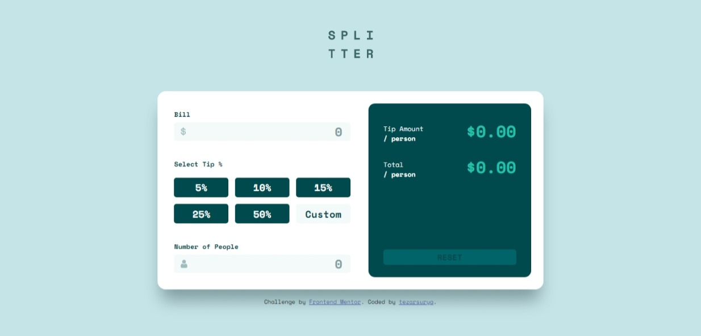
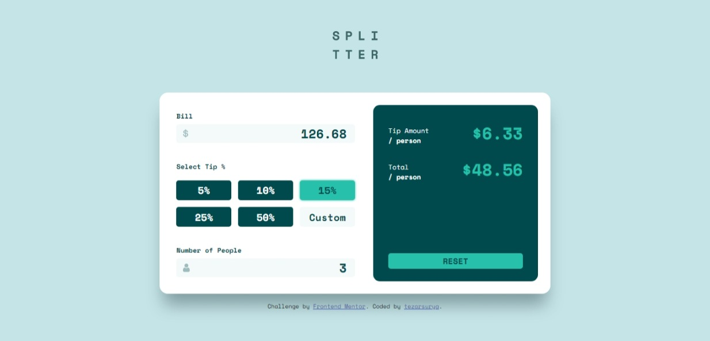

# Frontend Mentor - Tip calculator app solution

This is a solution to the [Tip calculator app challenge on Frontend Mentor](https://www.frontendmentor.io/challenges/tip-calculator-app-ugJNGbJUX). Frontend Mentor challenges help you improve your coding skills by building realistic projects.

## Table of contents

- [Frontend Mentor - Tip calculator app solution](#frontend-mentor---tip-calculator-app-solution)
  - [Table of contents](#table-of-contents)
  - [Overview](#overview)
    - [The challenge](#the-challenge)
    - [Screenshot](#screenshot)
    - [Links](#links)
  - [Built with](#built-with)
  - [Author](#author)

## Overview

### The challenge

Users should be able to:

- View the optimal layout for the app depending on their device's screen size
- See hover states for all interactive elements on the page
- Calculate the correct tip and total cost of the bill per person

### Screenshot

### Links

- Solution URL: [Click Here](https://www.frontendmentor.io/solutions/mobile-first-using-react-and-sass-IqwJTsgGp)
- Live Site URL: [https://holy-tip-calculator.netlify.app/](https://holy-tip-calculator.netlify.app/)

## Built with

- ReactJS
- SASS
- CSS Flexbox
- CSS Grid
- Mobile-first workflow

## Author

- Frontend Mentor - [@tezarsurya](https://www.frontendmentor.io/profile/tezarsurya)
- Instagram - [@tezarsurya](https://www.instagram.com/tezarsurya/)
